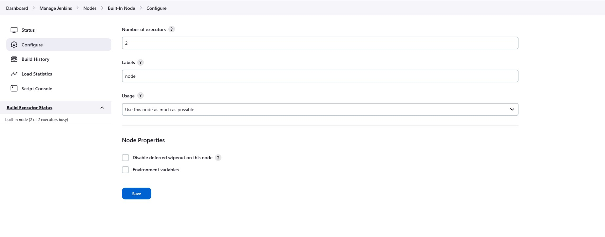
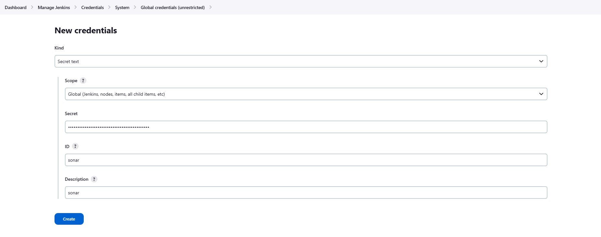
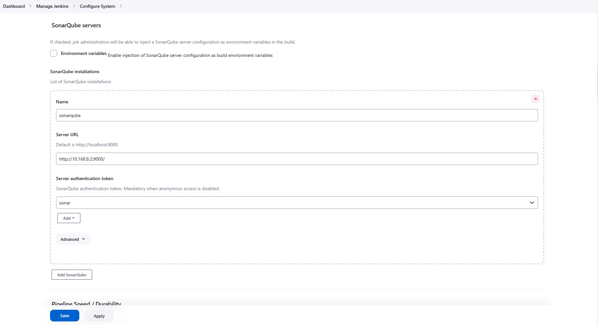
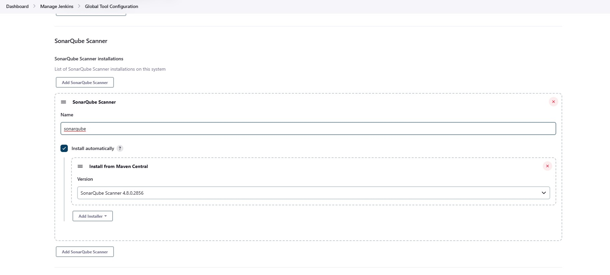

# jenkins-example

Simple jenkins pipeline example to build docker image, run several scan, push to docker hub, and deploy it in k3s
All in one instance of VM

## Prerequisite

* docker

> sudo apt-get update\
> sudo apt-get install docker.io\
> sudo groupadd docker\
> sudo usermod -aG docker $USER

* k3s

> curl -sfL https://get.k3s.io | sh -s - server --write-kubeconfig-mode 644 --disable=traefik

* [NGINX Ingress Controller](https://kubernetes.github.io/ingress-nginx/deploy/#bare-metal-clusters)

* [Jenkins](https://www.digitalocean.com/community/tutorials/how-to-install-jenkins-on-ubuntu-22-04)

* [Sonarqube](https://linux.how2shout.com/install-sonarqube-on-ubuntu-20-04-18-04-server/)

## Setup  Jenkins

1. Add user jenkins to the `docker` and login into docker hub

> sudo usermod -aG docker jenkins\
> sudo su jenkins\
> docker login

2. Give user write permission to folder Jenkins (for owasp-dependecy check to write report)

> sudo chown root:docker /var/lib/jenkins\
> sudo chmod g+w /var/lib/jenkins

3. In Jenkins, make sure you have node with specific Labels, in this case we use Built-in Node

4. Add SonarQube Scanner to plugin jenkins

5. Generate Global Analysis Token for Jenkins in Sonarqube

6. Create **secret text** credential containing sonarqube token

7. Configure Sonarqube server in Jenkins system, use `$IP-address:9090`

8. Add Sonarqube Scanner in Global Tool Configuration Jenkins

9. Create a Multibranch Pipeline, use `https://github.com/kinurra/jenkins-example.git` as git source

## Post Setup

TO access the running app add domain hostname to /etc/hosts file
Add the following to `/etc/hosts`

> $IP-address test.me

curl or navigate to [test.me](test.me) to view the app